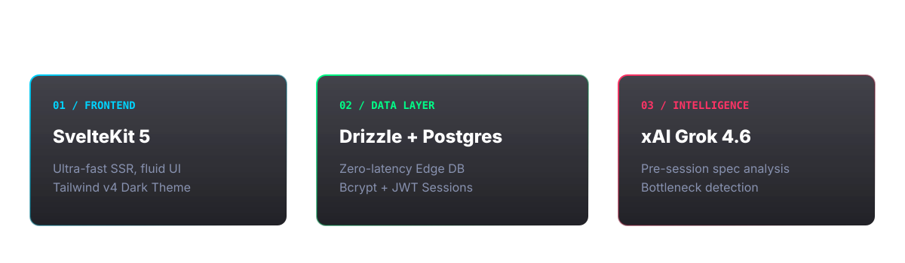
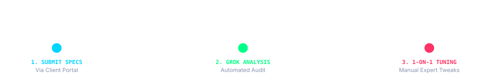

  

 

  
  
  

 

  

 

  

 

## ✦ Local Deployment

<b>View Terminal Commands</b>

 

**1. Environment Configuration**
`ash
cp .env.example .env
# Edit .env with your PostgreSQL URL and Grok API Key
`

**2. Database Migrations**
`ash
pnpm install
pnpm db:push
`

**3. Launch Dev Server**
`ash
pnpm dev
`

 

  

