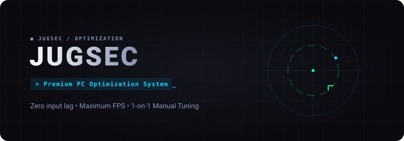

  

 

  
  
  

 

> **JUGSEC** is an ultra-premium, 1-on-1 PC optimization service. No automated snake-oil. Deep, manual hardware and OS tuning (BIOS, Registry, GPU, Windows) built for competitive esports players who need zero input lag and maximum stable frames.

 

## ✦ System Architecture

This repository hosts the **Client Portal**. It allows users to register, securely submit their PC specifications, and undergo a preliminary system audit (powered by Grok 4.6) before their 1-on-1 remote tuning session.

| 01 / FRONTEND | 02 / BACKEND | 03 / AI AUDIT |
|:---|:---|:---|
| **SvelteKit 5 (Runes)** Ultra-fast SSR and state management. | **PostgreSQL + Drizzle** Secure, strictly typed schema. | **xAI Grok 4.6** Pre-session spec analysis. |
| **Tailwind v4** Custom dark theme & fluid UI. | **Bcrypt Auth** HTTP-Only JWT Sessions. | **Actionable Intel** Saves manual triage time. |

 

## ✦ Local Deployment

<b>View Setup Instructions</b>

 

**1. Environment Configuration**
`ash
cp .env.example .env
`
Add your \DATABASE_URL\ (Neon.tech / Supabase) and \XAI_API_KEY\.

**2. Install & Sync Schema**
`ash
pnpm install
pnpm db:push
`

**3. Launch System**
`ash
pnpm dev
`
Access the portal at \http://localhost:5173\.

 

## ✦ Repository Topology

- \src/routes/(landing)\ — Conversion pages & esport social proof (\/proof\).
- \src/routes/dashboard\ — The client portal for spec submission.
- \src/lib/server\ — Core logic, auth middleware, and xAI integrations.

 

  

